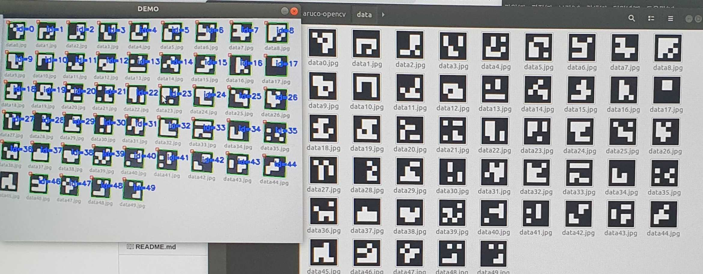

# aruco-opencv
 - Ubuntu 18.04/Raspbian
 - opencv-python 4.1.1, python3
 - might need "sudo apt install libhdf5-dev -y"

# main.py
 - python3 main.py --mode create_files (create_marker file)
 - python3 main.py --mode detect (webcam demo using opencv)

# demo (left-webcam view)

